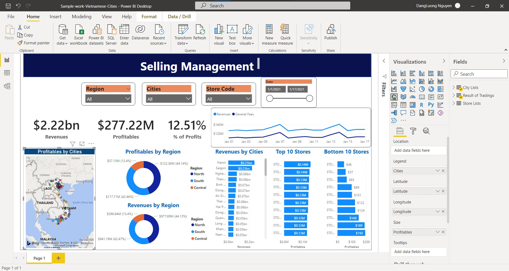
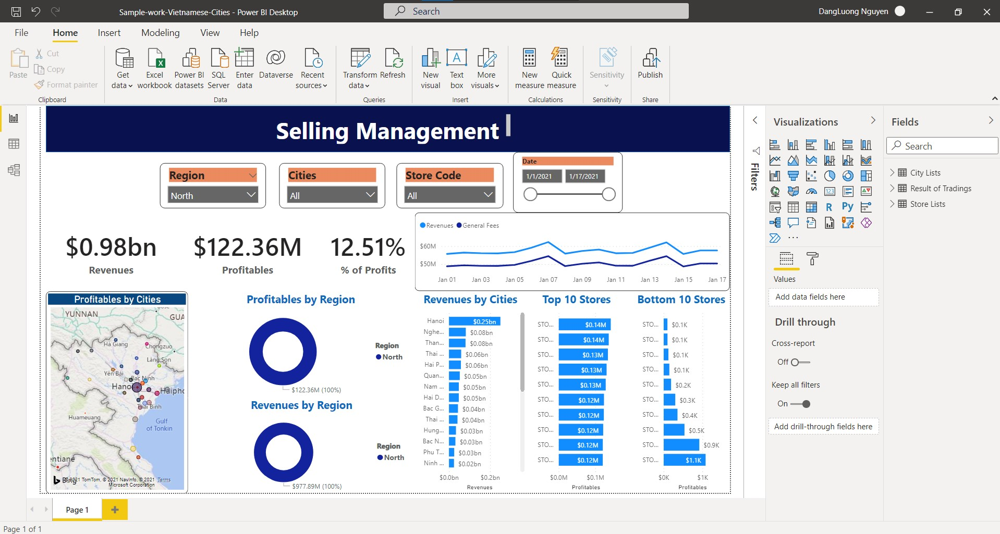
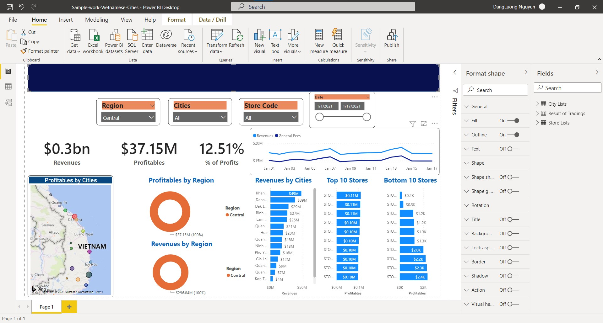
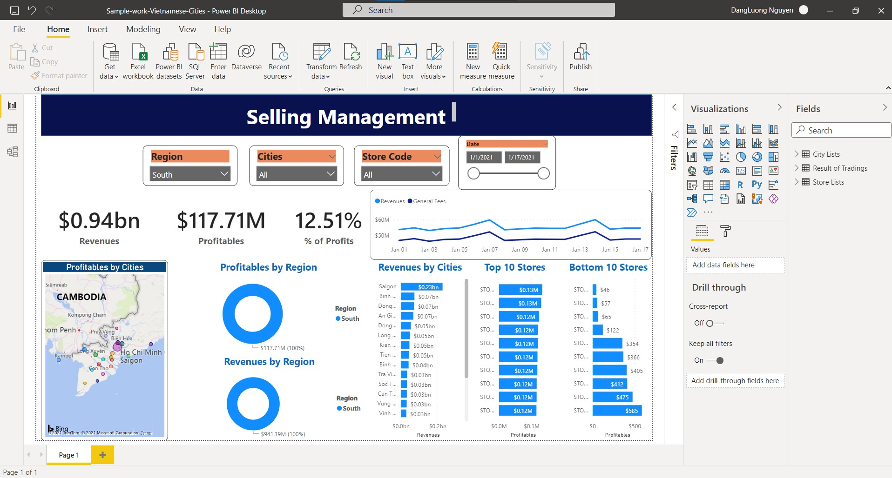

# Report-PowerBI

## Installation
Clone this repository and import into **PowerBI**
```bash
git clone https://github.com/ThucNguyen007/report-powerBI.git
```

## Maintainers
This project is maintained by:
* [Thuc Nguyen](https://github.com/ThucNguyen007)

### Built With

- [PowerBI Desktop](https://powerbi.microsoft.com/en-us/desktop/)
- [Package of Microsoft Office ](https://www.microsoft.com/en-us/education/products/office)

## Contact

Thuc Nguyen - [Thuc Nguyen](https://www.linkedin.com/in/thuc-nguyen-b0327313b/)

Project Link: [https://github.com/ThucNguyen007/report-powerBI/](https://github.com/ThucNguyen007/report-powerBI/)

<!-- ACKNOWLEDGEMENTS -->

## Acknowledgements

- [Become Data Analyst LinkedIn Learning](https://www.linkedin.com/learning/paths/become-a-data-analyst?u=90029442)
- [Learning Microsoft PowerBI Desktop](https://www.linkedin.com/learning/learning-microsoft-power-bi-desktop-14165789/model-and-visualize-your-data-with-power-bi-desktop?u=90029442) by Gini Von Courter
- [Salesforce sales Manager](https://docs.microsoft.com/en-us/power-bi/connect-data/service-template-apps-samples)
- [Excel Data](https://docs.google.com/spreadsheets/d/1cLYQjyTNLHms6xnwQjhAjeqoyv-db8fx/edit#gid=911814947)

### 🛠 App Demos 💰📈 Exercises

<br />
<p>
  <h3 align="center">All of Vietnamese Regions</h3>
  <a>
  
  </a>
  <h3 align="center">North Region</h3>
  <a>
  
  </a>
  <h3 align="center">Central Region</h3>
  <a>
  
  </a>
  <h3 align="center">South Region</h3>
  <a>
  
  </a>
</p>

